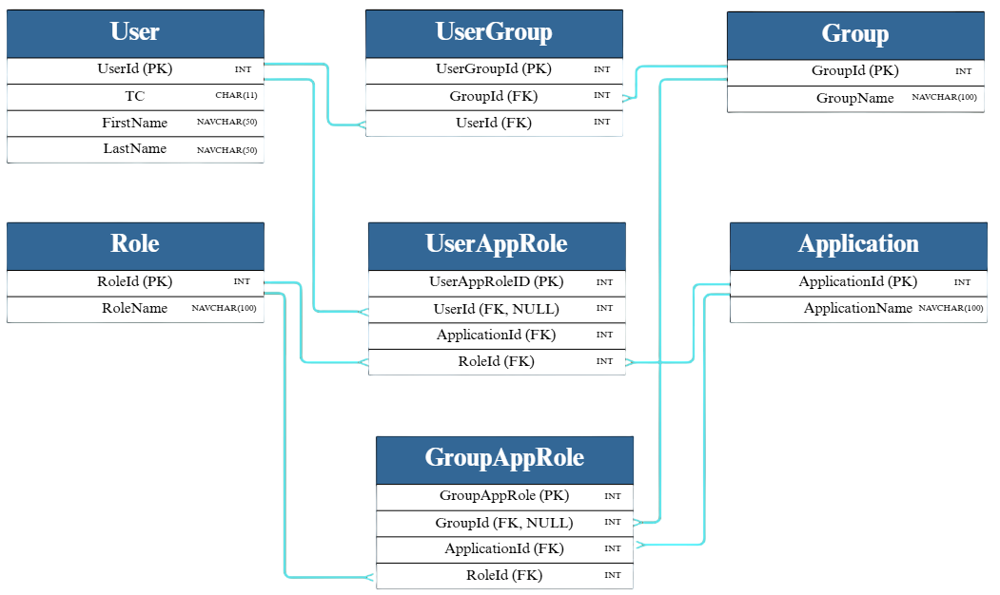

#  KumAccess

KumAccess, kurum içindeki kullanıcıların, grupların ve rollerin çeşitli uygulamalara olan erişim yetkilerini yönetmeye yönelik geliştirilmiş bir **kullanıcı yetkilendirme web uygulamasıdır**.  
Proje kapsamında, kullanıcıların ve kullanıcı gruplarının belirli uygulamalarda hangi rollerle yetkili oldukları merkezi bir panelden yönetilebilmektedir.  

## 🎯 Amaç
- Kurum içi uygulamalara erişim süreçlerini **kontrol edilebilir** ve **merkezi** hale getirmek.  
- Kullanıcı, grup, rol ve uygulama temelli yetkilendirme mekanizması oluşturmak.  
- İnsan Kaynakları tarafından toplu şekilde sağlanan kullanıcı listesini kullanarak yetki atamalarını gerçekleştirmek.  

## ⚙️ Teknolojiler
- **Frontend**: HTML, CSS  
- **Backend**: C# (.NET)  
- **Database**: SQL Server  

## 📊 Veri Modeli
Sistemde şu yapılar bulunmaktadır:
- **Users**: İnsan Kaynakları tarafından sağlanan kullanıcılar (manuel eklenemez).  
- **Groups**: Kullanıcı grupları.  
- **Roles**: Uygulamalara atanabilen roller.  
- **Applications**: Yetkilendirme yapılacak kurum içi uygulamalar.  

Bu yapılar arasındaki ilişkiler **ER Diyagramı** ile tanımlanmıştır.  

## 🖥️ Arayüz Tasarımı
Arayüz tasarımları **Figma** ile hazırlanmış olup, sol tarafta sabit bir menü ve sağ tarafta içerik alanı yer almaktadır.  

- **Applications**: Uygulama listesi, detay ve ekleme işlemleri (accordion + popup yapısı).  
- **Users**: Kullanıcı listesi, kullanıcı detayları, rol/grup atamaları.  
- **Roles**: Roller, kullanıcı görüntüleme ve yeni rol oluşturma.  
- **Groups**: Gruplar, grup üyeleri ve uygulama bazlı rol atamaları.
- 
## 💾 Veritabanı Yedeği
Projede kullanılan SQL Server veritabanı yedeğine aşağıdan ulaşabilirsiniz: [📂 kumaccess.bak](https://github.com/ilaydaKaracuka/KumAccess/blob/master/kumaccess.bak)

